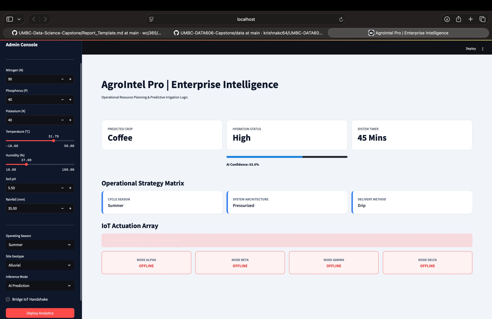
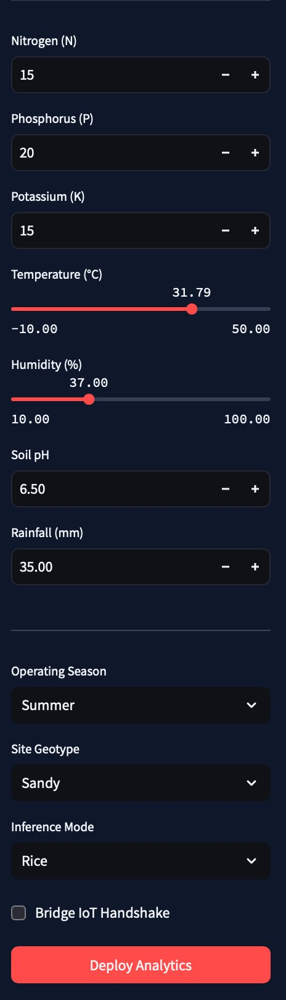
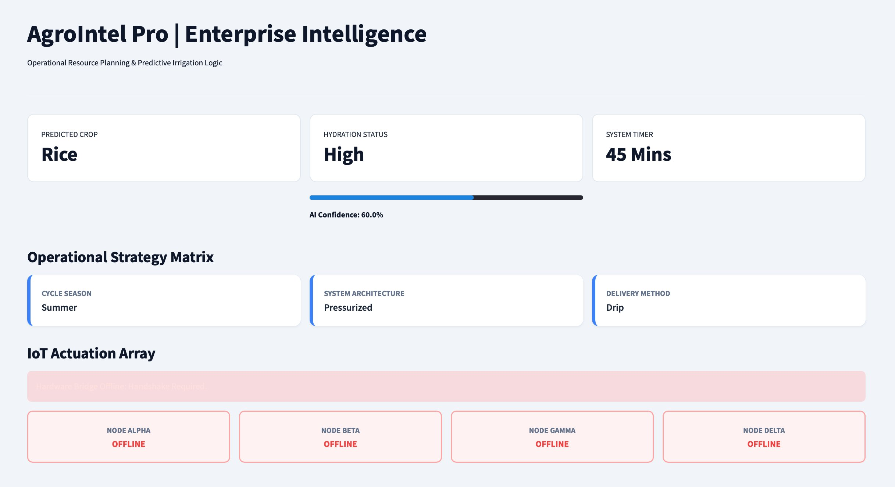

# AgroIntel: A Multi-Model AI Framework for Optimized Crop Selection and Precision Irrigation

**Author:** Punith Akash Balachandran  
**Semester:** Spring 2026  
**Project Title:** AgroIntel: A Multi-Model AI Framework for Optimized Crop Selection and Precision Irrigation
**Prepared for:** UMBC Data Science Master Degree Capstone by Dr. Chaojie (Jay) Wang

| | |
|---|---|
| **Author** | Punith Akash Balachandran |
| **GitHub** | [UMBC-DATA606-Capstone](https://github.com/PUNITHAKASH/UMBC-DATA606-Capstone) |
| **LinkedIn** | [punith-akash-a145a024a](https://www.linkedin.com/in/punith-akash-a145a024a/) |
| **PowerPoint** | *(https://youtu.be/Y12QAFjHgdM)* |
| **YouTube** | *(https://www.youtube.com/channel/UCJ67cjhZxqNShl35LATjLwQ)* |

---

## 2. Background

### What is it about?

AgroIntel is an Intelligent Agricultural Decision Support System that integrates strategic crop recommendations based on soil nutrients with tactical irrigation forecasting using real-time climate data.

### Why does it matter?

Global agriculture faces a "dual challenge" of rising food demand and dwindling water resources. Conventional methods rely on anecdotal evidence, leading to waste. This project utilizes machine learning to transition toward precision agriculture, lowering environmental footprints and operational costs.

### Research Questions

1. Can ensemble learning forecast irrigation requirements accurately based on environmental variables?
2. How effectively can soil pH and nutrients prescribe biologically adapted crops?
3. Can multiple ML models be integrated into a unified web application for real-time farming advice?

---

## 3. Data

### Data Sources & Characteristics

| Layer | File | Rows | Columns | Size | Row Represents |
|---|---|---|---|---|---|
| Strategic | `Crop_recommendation.csv` | 2,200 | 8 | ~146 KB | A soil sample |
| Tactical | `irrigation_prediction.csv` | 10,000 | 19 | ~1.17 MB | A field snapshot |
| Operational | `irrigation_machine.csv` | 2,000 | 23 | ~177 KB | A sensor grid reading |

### Data Dictionary (Key Variables)

| Column Name | Data Type | Definition | Potential Values |
|---|---|---|---|
| N, P, K | Numerical | Nitrogen, Phosphorus, Potassium levels | 0–140+ |
| Soil_pH | Numerical | Acidity/Alkalinity of soil | 0.0–14.0 |
| Temperature_C | Numerical | Ambient temperature | -10°C to 50°C |
| Humidity | Numerical | Relative atmospheric humidity | 10%–100% |
| Irrigation_Need | Categorical | **Target Variable (Tactical)** | Low, Medium, High |
| label | Categorical | **Target Variable (Strategic)** | Rice, Maize, etc. |

### Target and Feature Variables

| Model | Target Variable | Feature Variables |
|---|---|---|
| Crop Recommender | `label` | N, P, K, Temperature, Humidity, pH, Rainfall |
| Irrigation Classifier | `Irrigation_Need` | Soil Type, Crop Type, Season, Temp, Humidity, Rainfall, Irr. Type/Method |
| IoT Valve Controller | `valve_state` | sensor_1 through sensor_20 |

---

## 4. Exploratory Data Analysis (EDA)

- **Cleaning:** Checked for missing values and duplicates using `isnull().sum()` and `duplicated()`.
- **Tidying:** Ensured each row represents a unique observation with one property per column.
- **Visualization:** Used Plotly Express to identify nutrient clusters (N vs. P) and environmental drivers (Temperature vs. Humidity) for irrigation needs.
- **Summary Stats:** Generated summary statistics for soil chemistry and weather variables to detect outliers.

---

## 5. Model Training

- **Models:** Ensemble learning (Random Forest, XGBoost) and IoT Actuation models.
- **Training Strategy:** 80/20 Train-Test split.
- **Packages:** scikit-learn, pandas, numpy, pickle.
- **Development Environments:** Google Colab for training; local laptop for Streamlit deployment.
- **Performance Measurement:** Accuracy, Precision, Recall, and F1-Score to compare model reliability.

---

## 6. Application of the Trained Models

**Tool:** Streamlit - selected for its ability to deliver enterprise-grade interactive dashboards with minimal overhead.

### Full Application View

The screenshot below shows the complete AgroIntel Pro interface with the Admin Console (left sidebar) and the main analytics dashboard (right panel):

*Figure 1 — AgroIntel Pro running locally, showing the Admin Console and full dashboard output*

---

### Admin Console - Input Configuration

The left-hand Admin Console allows users to configure all field parameters before deploying analytics:

- **Soil Nutrient Matrix:** Nitrogen (N), Phosphorus (P), Potassium (K), Soil pH, and Rainfall (mm)
- **Environmental Telemetry:** Temperature (°C) and Humidity (%) via interactive sliders
- **Operating Season:** Summer, Winter, or Monsoon
- **Site Geotype:** Soil classification (Sandy, Clay, Alluvial, etc.)
- **Inference Mode:** AI Prediction or manual crop override
- **Bridge IoT Handshake:** Toggle to activate valve actuation nodes
- **Deploy Analytics:** Triggers all three ML models simultaneously

*Figure 2 — Admin Console: structured input fields for soil nutrients, climate telemetry, and operational configuration*

---

### Dashboard Output — Predictions & IoT Array

Once analytics are deployed, the main dashboard renders three layers of output:

**Metric Cards:**
- **Predicted Crop** — AI-recommended crop (e.g., Rice, Coffee) based on soil and climate inputs
- **Hydration Status** — Irrigation need classification (Low / Medium / High) with AI confidence bar
- **System Timer** — Recommended irrigation duration in minutes

**Operational Strategy Matrix:**
- Cycle Season, System Architecture (Pressurized / Surface), and Delivery Method (Drip / Manual)

**IoT Actuation Array:**
- Four field nodes (ALPHA, BETA, GAMMA, DELTA) display ACTIVE / STANDBY / OFFLINE status based on IoT model predictions

*Figure 3 — AgroIntel Pro dashboard showing Predicted Crop (Rice), Hydration Status (High, 60% confidence), Operational Strategy Matrix, and IoT node array*

---

### Key Features Summary

| Feature | Description |
|---|---|
| Crop Prediction | Recommends optimal crop from 22 classes using soil + climate inputs |
| Hydration Status | Classifies irrigation need as Low / Medium / High with confidence score |
| Frost Safety Protocol | Locks all systems into Emergency Shutoff when Temperature ≤ 0°C |
| IoT Node Actuation | Four virtual nodes (ALPHA–DELTA) receive ON/OFF valve signals from ML inference |
| Strategy Matrix | Displays Season, System Architecture, and Delivery Method as unified operational output |

---

## 7. Conclusion

**Summary:** The project successfully bridges soil science and real-time climate tracking to deliver high-fidelity farming insights via a web interface. The three-layer ML architecture — Strategic (crop), Tactical (irrigation), and Operational (IoT) — provides a complete precision agriculture decision stack.

**Limitations:**
- The IoT layer is currently based on simulated sensor data; real-world hardware integration is required for field testing.
- Models depend on publicly available datasets that may not capture local agronomic nuances for all geographies.
- Frost protection uses a fixed threshold rule (≤ 0°C) rather than a dynamic weather forecast.

**Lessons Learned:**
- Machine learning accuracy improves significantly when augmenting datasets with expert-knowledge ground truths.
- Hybrid rule-based and ML logic strengthens system safety beyond what pure ML provides.
- Serializing label encoders alongside model artifacts is critical for consistent inference.

**Future Direction:**
- Integrate a live weather API for real-time temperature and rainfall inputs.
- Expand IoT module to process real sensor streams from physical hardware.
- Incorporate satellite imagery and NDVI indices for remote crop health assessment.

---

### 8. Future Research Direction
* Transition from localized sensor readings to area-based health tracking by utilizing satellite remote sensing and NDVI data streams.
* Dynamically align regional crop selections with financial profitability metrics by integrating active commodity marketplace pricing APIs.
* Expand node management scalability through decentralized multi-farm mesh network integrations.

## 9. References

1. Dr. Chaojie Wang — UMBC Data Science Capstone Guidelines.
2. Scikit-learn Documentation. [https://scikit-learn.org/stable/](https://scikit-learn.org/stable/)
3. Streamlit Documentation. [https://docs.streamlit.io](https://docs.streamlit.io)
4. Atharva Ingle — Crop Recommendation Dataset. [Kaggle](https://www.kaggle.com/datasets/atharvaingle/crop-recommendation-dataset)
5. Chen, T. & Guestrin, C. (2016) — XGBoost: A Scalable Tree Boosting System. [arXiv](https://arxiv.org/abs/1603.02754)
6. FAO — Water for Sustainable Food and Agriculture. [https://www.fao.org](https://www.fao.org)
